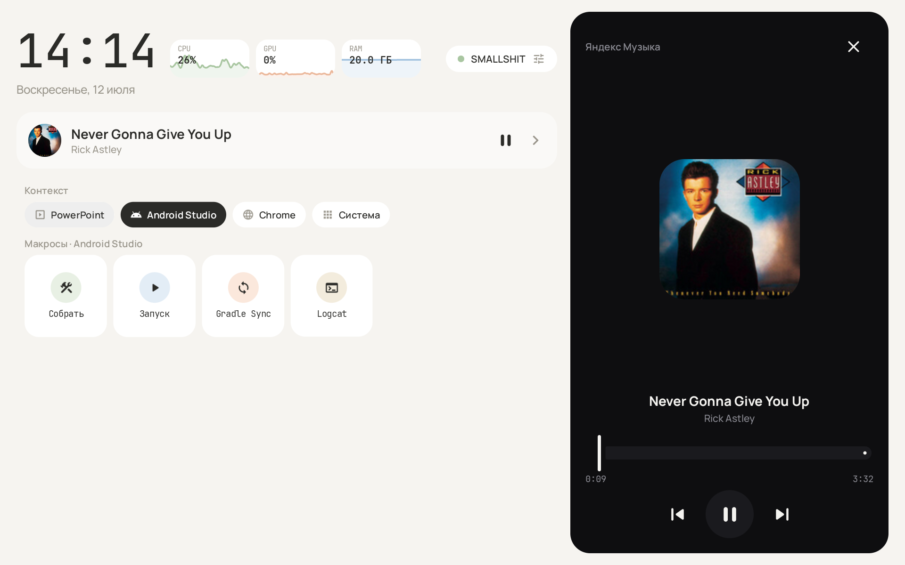
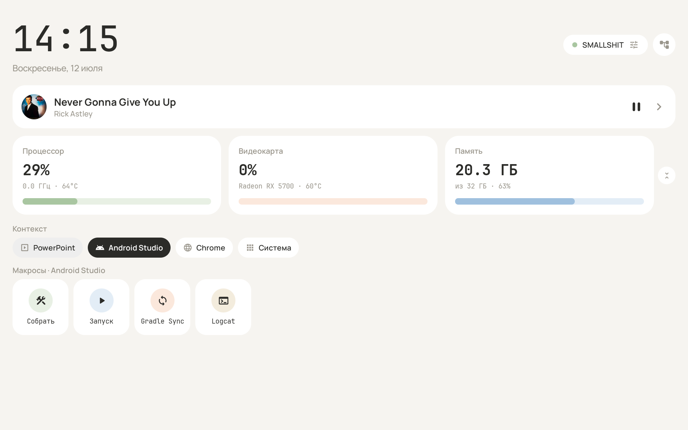
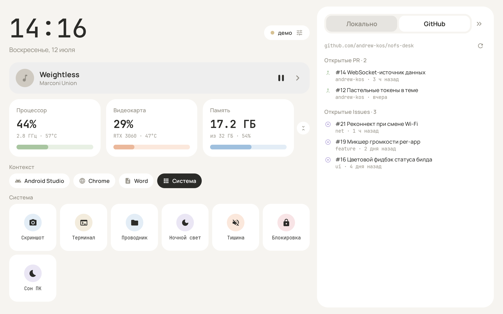
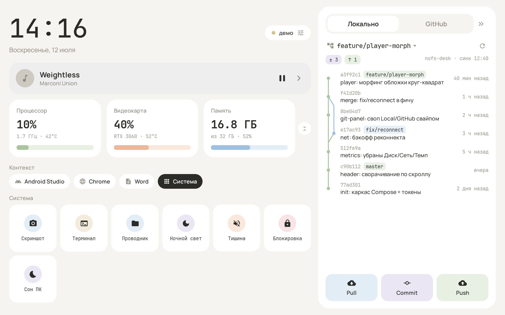

# NOFS Desk

Планшет-компаньон для Windows-ПК: панель на Android-планшете (альбомная, иммерсив) +
агент в трее на ПК. Пастельный флэт, сворачивающаяся шапка, метрики CPU/GPU/RAM,
контекстные макросы, панель Git/GitHub, чёрный плеер с морфингом обложки.

## Состав
- `android/` — Android-приложение (Kotlin + Jetpack Compose, `minSdk 26`);
  в Android Studio открывать именно эту папку.
- `agent/` — агент на ПК (.NET 8, трей): метрики LibreHardwareMonitor,
  медиа-сессия Windows, контекстные макросы, git/GitHub. См. `agent/README.md`.

## Запуск

**Планшет:** открыть папку в Android Studio (Koala+), синк Gradle, Run.
Путь проекта — без кириллицы (грабли AGP). Из коробки работает демо-режим
(фейковые данные) — панель живая без ПК.

**ПК:** собрать и запустить агента (см. `agent/README.md`) — права администратора
не нужны, кроме опционального доступа к температурам CPU/GPU.

**Связка:** на планшете тап по чипу статуса (справа в шапке) → выключить
демо-режим → «Найти ПК в сети» (UDP-автопоиск) или ввести IP вручную → Применить.
Планшет и ПК должны быть в одной локальной сети.

## Где что (планшет)

- `data/DeskState.kt` — модели; `data/DeskDataSource.kt` — интерфейс-шов.
- `data/FakeDeskDataSource.kt` — демо-источник; `net/WebSocketDeskDataSource.kt` — реальный.
- `net/Protocol.kt` — JSON-протокол (зеркало `agent/NofsAgent/Protocol.cs`).
- `net/Discovery.kt` — UDP-автопоиск агента.
- `DeskViewModel.kt` — выбирает источник по настройкам, отдаёт `StateFlow<DeskState>`.
- `ui/DeskScreen.kt` — сборка экрана; `ui/components/*` — компоненты.
